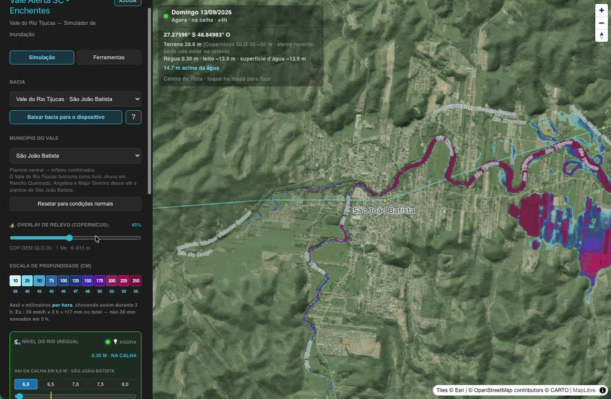
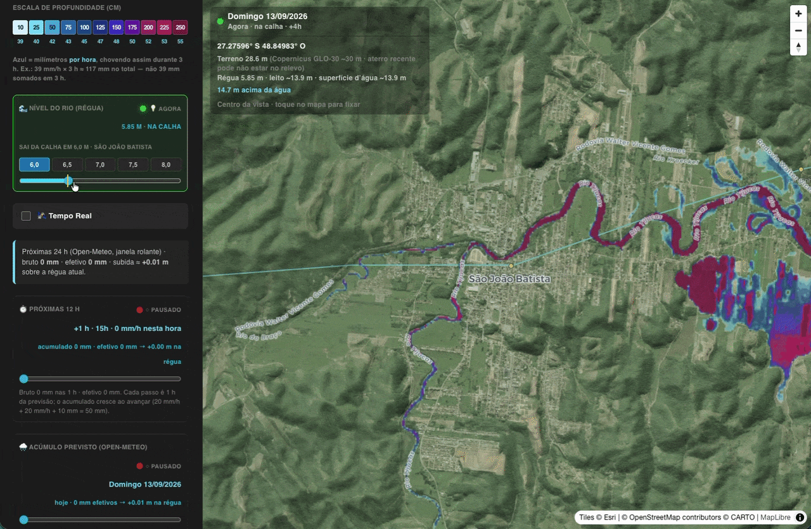
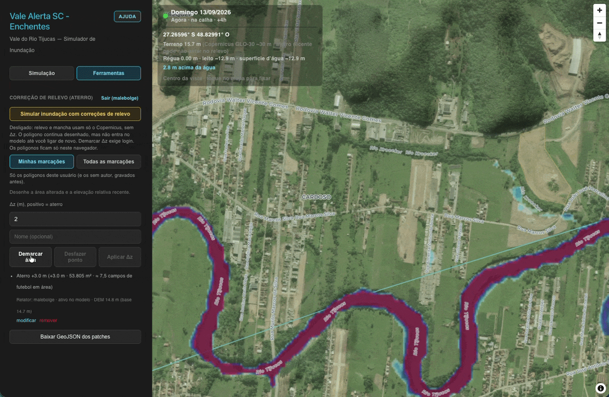

# 🌊 Vale Alerta SC — Simulador Cidadão de Inundação Regional

O **Vale Alerta SC** é uma plataforma web interativa, de código aberto e ultra-leve, desenvolvida para traduzir previsões meteorológicas complexas em informações visuais simples, práticas e acionáveis para o cidadão comum.

Focado inicialmente na bacia do **Vale do Rio Tijucas** (Rancho Queimado, Angelina, Major Gercino, Nova Trento, São João Batista, Canelinha e Tijucas), o motor é **independente de localização**. Novas bacias entram como JSON em `regions/` — o **Vale do Itajaí** já está como segundo pacote (provisório: Itajaí-Açu + Itajaí-Mirim). Veja `CONTRIBUTING.md`.

---

## Documentação do repositório

Simulador de enchentes/inundação causados por altos volumes de chuva.

Pacotes atuais: **Vale do Rio Tijucas** e **Vale do Itajaí** (com dados provisórios).

* **Novas bacias:** [`regions/`](regions/) e [`CONTRIBUTING.md`](CONTRIBUTING.md).
* **Limites do Copernicus DEM e correções Δz:** [`OPTIMIZATIONS.md`](OPTIMIZATIONS.md).
* **Como contribuir ou adicionar novas regiões:** [`CONTRIBUTING.md`](CONTRIBUTING.md).
* **PWA** (instalação em computador ou celular, uso online/offline): [`PWA.md`](PWA.md).
* **Deploy** (Supabase + EC2/Caddy, testes e troubleshooting): [`DEPLOY.md`](DEPLOY.md).
* **Contas, papéis e demarcações de relevo:** projeto Supabase + [`backend-database/migrations.sql`](backend-database/migrations.sql); o dashboard lê e grava polígonos na tabela assim que o relator aplica o Δz (ver [Contas, papéis e banco](#contas-papéis-e-banco)).

---

## 🎯 Propósito e Motivação

Mudar-se, salvar os móveis ou ficar em casa? Quem vive em regiões propensas a enchentes conhece a angústia de ouvir alertas de *"150 milímetros de chuva nas próximas horas"*. Para a maioria das pessoas, esse número não faz sentido na prática. Ninguém sabe se essa chuva vai apenas molhar a calçada ou cobrir o telhado.

O Vale Alerta SC resolve esse problema redesenhando a forma como a comunidade entende o risco climático, focando em dois pilares:

1. **Atualização Contra Terraformação Humana:** Antigamente, as gerações passadas sabiam de cabeça quando o rio subiria. Hoje, o crescimento urbano acelerado mudou as regras do jogo. Cada prédio construído, cada galpão asfaltado e cada terreno baixo aterrado alteram o caminho da água. Usando dados de relevo por satélite (Copernicus DEM), este simulador computa onde a água se acumula **no terreno da vista atual**, e não numa carta de 20 anos atrás.
2. **O Efeito Funil e Sincronização de Encostas:** O sol pode estar brilhando no centro de São João Batista, mas um temporal severo caindo simultaneamente nas montanhas de Major Gercino, Angelina e Rancho Queimado — ou no Ribeirão Alferes em Nova Trento — criará uma onda de cheia combinada que descerá o vale. O simulador ajuda o morador a olhar para o topo da montanha e antecipar o perigo com horas de antecedência.

O objetivo do projeto não é causar pânico, mas sim **trazer paz de espírito através da alfabetização climática**. O morador aprende a mexer nos controles (régua do rio, acúmulo previsto de chuva, horizonte de tempo) e vê no mapa **quantos centímetros de água cobrem cada trecho de terra**, sabendo quanto tempo de janela ele tem para se mover com segurança.

---

## 🧠 Guia Didático: Entendendo as Dinâmicas da Água no Vale

Para compreender como os cálculos do simulador funcionam, é preciso entender que uma inundação em cidades de vale (como São João Batista) não é um evento isolado, mas sim o resultado de uma engrenagem geográfica viva. O aplicativo divide a dinâmica da água em três comportamentos principais:

### 1. O "Efeito Funil" e a Sincronização Upstream (Enchente Fluvial)
O erro mais comum de um cidadão é olhar para o céu da sua própria cidade, ver que não está chovendo forte e assumir que está seguro. 

O Vale do Rio Tijucas funciona como um funil gigante. Cidades como Rancho Queimado, Angelina e Major Gercino ficam no topo desse funil (região de cabeceira), enquanto São João Batista fica na parte estreita, mais abaixo. 
* **Acúmulo por Junção de Canais:** Se chover 100mm em Major Gercino e, ao mesmo tempo, chover 100mm em Nova Trento, a água dessas duas bacias independentes corre em direção ao leito principal do Rio Tijucas. 
* **O Efeito Somatório:** Quando essas massas de água se encontram logo acima de São João Batista, os volumes se **somam matematicamente**. Se o rio em Major Gercino está jogando 300 m³/s (metros cúbicos por segundo) e o ribeirão de Nova Trento está jogando 150 m³/s, o leito em São João Batista é subitamente forçado a absorver **450 m³/s**, causando um transbordamento repentino mesmo que na cidade tenha caído apenas uma garoa.

### 2. O "Tempo de Lag" (Velocidade da Onda de Cheia)
A água não se desloca instantaneamente. Ela viaja pelas curvas do rio a uma velocidade que depende da inclinação do terreno e do volume do canal. Esse intervalo é chamado de **Tempo de Lag** (ou tempo de retardo), e é ele que cria a nossa "janela de evacuação":
* **A Janela de 4 Horas:** Historicamente, uma onda de cheia severa (o pico da subida do rio) leva cerca de **4 horas** para percorrer a distância física entre os medidores de Major Gercino e o centro urbano de São João Batista.
* **Como o Simulador Calcula:** Quando o usuário ajusta o slider de tempo (`Intervalo: +4h`), o motor do aplicativo projeta onde a água que caiu na montanha 4 horas atrás estará pisando no mapa da cidade agora. É essa física simplificada que gera o aviso: *"A ponte do centro ficará intransitável em 1h e 20min"*.

### 3. Acúmulo por Depressão Urbana e Proximidade do Rio (Enchente Pluvial e Fluvial)
Existe um segundo tipo de alagamento que o simulador calcula, que ocorre de forma totalmente separada do rio principal: o acúmulo por poças e bacias cegas (alagamento pluvial).
* **Bacias de Acúmulo e Áreas Baixas:** Cidades de vale possuem bairros planos cercados por morros ou espremidos contra as margens do rio principal. O simulador identifica e monitora as cotas de áreas críticas conhecidas na cidade:
  * **Bairro Fernandes:** Uma bacia cercada por encostas, altamente propensa ao acúmulo de enxurradas locais.
  * **Bairros Krequer, Tajuba e Cardoso:** Setores situados nas cotas topográficas mais baixas da malha urbana e diretamente adjacentes ao leito do Rio Tijucas. Quando o nível do rio sobe, essas áreas sofrem com o transbordamento direto e com o efeito de refluxo (a água da chuva que deveria escorrer para o rio não consegue entrar no canal e inunda as ruas de trás).
* **A Geometria Pluvial:** O simulador identifica esses "pontos de pia" no mapa. À medida que o slider de milímetros de chuva aumenta, esses blocos isolados começam a pintar o mapa de roxo/azul de forma desconectada do rio, mostrando ao motorista que aquela rua específica vai acumular água da própria enxurrada local, cortando o trânsito antes mesmo do rio principal transbordar.

---

### 🔬 Como a Física Plana Simplifica o Código
A grande virada de chave do **Vale Alerta SC** é como ele faz esse cálculo rodar instantaneamente em um celular antigo. Em vez de rodar simulações pesadas de dinâmica de fluidos no servidor (que levariam horas), o aplicativo usa o princípio de que **a superfície da água em repouso é plana em relação ao nível do mar**.

O aplicativo calcula a cota absoluta que o rio vai atingir (ex: `Cota da Água = 26 metros acima do nível do mar`). Em seguida, a placa gráfica (GPU) do celular faz uma conta de subtração pixel por pixel contra o mapa de relevo (`Copa-DEM`):

$$\text{Profundidade na Rua} = \text{Cota da Água (26m)} - \text{Altitude do Asfalto (25.5m)} = 0.5\text{m} \rightarrow \mathbf{50cm\ de\ Alagamento}$$

Se o resultado for maior que zero, o pixel acende na cor correspondente do heatmap (Cian, Azul ou Roxo). Se for menor ou igual a zero, a rua permanece perfeitamente seca e visível no satélite. É essa matemática direta que torna o simulador uma ferramenta de precisão em tempo real.

---

## ✨ Funcionalidades implementadas

Resumo (o dashboard em `frontend-dashboard/`):

- [Barra: Simulação e Ferramentas](#barra-simulação-e-ferramentas)
- [Mapa híbrido e navegação](#mapa-híbrido-e-navegação)
- [Relevo Copernicus na vista](#relevo-copernicus-na-vista)
- [Heatmap de profundidade](#heatmap-de-profundidade)
- [Régua do rio e cota de transbordo](#régua-do-rio-e-cota-de-transbordo)
- [Previsão de 7 dias (Open-Meteo)](#previsão-de-7-dias-open-meteo)
- [Previsão horária (12 h)](#previsão-horária-12-h)
- [Escala de profundidade (cm e mm/h)](#escala-de-profundidade-cm-e-mmh)
- [Janela de escape](#janela-de-escape)
- [Tempo real (ANA × Open-Meteo)](#tempo-real-ana--open-meteo)
- [Sonda do terreno](#sonda-do-terreno)
- [Correção de relevo (demarcação / aterro)](#correção-de-relevo-demarcação--aterro)
- [Contas, papéis e banco](#contas-papéis-e-banco)
- [Backend e configuração regional](#backend-e-configuração-regional)
- [App no dispositivo (PWA)](#app-no-dispositivo-pwa)

### Barra: Simulação e Ferramentas



- Duas abas no topo da barra (e da folha no celular): **Simulação** e **Ferramentas**.
- **Simulação:** bacia, município, overlay Copernicus, régua, Tempo Real, chuva (24 h / 12 h / 7 d), janela de escape. No celular, a **Sonda do mapa** também fica nesta lista; no computador a sonda continua no card do mapa.
- **Ferramentas:** correção de relevo. Sem login: aviso de que cadastro é obrigatório para enviar correções + formulário **Entrar | Cadastrar**. Com login: demarcar, Δz, vistas Minhas/Todas, simular com correções, GeoJSON.
- Botão **Ajuda** ao lado do título: abre uma segunda coluna à direita, com uma caixa por controle visível na aba atual. Com a ajuda aberta, o bloco e a caixa correspondente ganham borda; o hover destaca o par. Esc fecha. No celular a barra vira uma folha baixa; o mapa continua visível.
- **Baixar bacia para o dispositivo** (aba Simulação): grava pacote, retrato Open-Meteo/ANA e tiles Copernicus da bbox. Serve para PWA no telefone **e** no computador.

### Mapa híbrido e navegação

- Mapa **Esri World Imagery** + rótulos transparentes **CARTO Positron Labels**, com MapLibre GL JS.
- Seletor **Bacia**: Tijucas ou Itajaí. **Município do vale**: voa até a cidade e aplica a **régua e o transbordo iniciais daquele município**. A escolha fica como padrão desta bacia na próxima abertura. Pan/zoom atualizam a cota pela cidade mais próxima da vista (se você já mexeu na régua, ela permanece).
- Após pan, zoom ou troca de cidade, o app **espera 1 segundo** e recarrega relevo + heatmap para a **área visível** (com ~2 km de folga no grid de inundação para o rio não “sair” da malha).
- Badge no mapa com o **dia da semana** e se a mancha é Agora ou Previsão; lâmpadas verde/vermelha nos sliders indicam qual camada está viva.

### Relevo Copernicus na vista

- Hillshade gerado no navegador a partir do **Copernicus DEM GLO-30** (COG 1° no S3 público, ~30 m).
- Slider de **opacidade** do overlay (não recarrega o DEM: só muda a pintura).
- A **mesma malha de altitudes** alimenta o heatmap (profundidade ≈ cota da água − z do terreno).
- O GLO-30 é um **DSM** (telhado e copa entram na cota) e atualiza em **anos**, não em dias — aterro recente some do modelo até uma revisão do produto. Detalhes de erro: `OPTIMIZATIONS.md`.

### Heatmap de profundidade



- A mancha nas ruas é só o **excesso sobre o transbordo municipal**: `extra = max(0, régua − sai da calha)`. Régua 5 m com transbordo 6 m → **sem** heatmap de rua.
- Superfície d’água na vista: **WSE = talvegue do GLO-30 cru** (leito sem Δz de aterro) + extra × ocupação da janela de escape. O aterro **não sobe o rio**; só muda o terreno da rua.
- Preenchimento a partir do rio (flood-fill). Folga (~0,55 m) para ruído do DSM: a água pode passar, mas só pinta célula com z abaixo do WSE.
- Cores por profundidade **local**: **10, 25, 50, 75, 100 … 250 cm**.
- Só **uma** mancha por vez: arrastar a régua pinta **Agora**; arrastar as 12 h ou os 7 dias pinta **Previsão** e **liga Tempo Real**.
- Com **simular correções de relevo** ligado, se o polígono ocupar volume que estava inundado, esse volume **sobe a lâmina no entorno** (até ~4 m de acréscimo). Polígono pequeno diante da mancha → milímetros; o HUD mostra m³ deslocados.
- O overlay fica **georreferenciado** na malha do DEM (vista + ~2 km de folga). Após 1 s parado, relevo e heatmap recalculam.

### Régua do rio e cota de transbordo

- Slider desde o **nível natural no leito** (0 m nesta régua), não o nível do mar. Teto de simulação: **20 m**.
- Em São João Batista, a Defesa Civil registra ruas alagadas a partir de **6 m** nesta régua (Ribanceira do Sul / Loteamento Piva). Picos documentados: **6,85 m** (maio/2024, SDR/SC) e cerca de **9 m** (dez/2022, Epagri/Ciram).
- Seletor **sai da calha**: **6,0–8,0 m** em passos de 50 cm (marca amarela na régua). A escala mm/h da legenda usa essa cota.
- A série ANA 84095500 (dezenas de cm em estiagem) usa o **mesmo zero** de estiagem, não a cota municipal de transbordo.
- **Resetar para condições normais**: régua na cota ANA ao vivo (ou ~30 cm), previsão no **hoje** (slider 1), 12 h no primeiro passo, janela +4 h, camada Agora.

### Previsão de 7 dias (Open-Meteo)

- Caixa **próximas 24 h**: volume bruto e efetivo na janela rolante de 24 h (não é o dia 1 do slider).
- A semana **começa hoje**: o slider inicia em **1** (hoje). 7 = até o mesmo dia da semana seguinte menos um.
- Arrastar o slider **liga Tempo Real**: a régua não pode ficar abaixo da cota ANA, e o heatmap Previsão soma a chuva efetiva sobre essa régua (não sobre um rio “normal” no app).
- Chuva **efetiva** (não a soma bruta de 7 dias): balde horário com **meia-vida de 12 h**. Intervalos secos esvaziam o balde.
- Média a montante. Subida: `ΔH = chuva_efetiva_mm × coeficiente da bacia`. Cota no mapa ≈ régua (piso ANA se Tempo Real) + ΔH.
- A camada Previsão usa as **mesmas cores** de profundidade sobre o DEM da tela.

### Previsão horária (12 h)

- Slider **1–12 h** entre a caixa das 24 h e o acúmulo de 7 dias.
- Cada passo é **1 h** da série Open-Meteo; o acumulado soma as horas já percorridas (ex.: 20 mm/h + 20 mm/h + 10 mm = 50 mm), não “o valor da hora × 12”.
- Arrastar liga Tempo Real e pinta a mancha de **Previsão** daquela janela. O HUD mostra `+N h · HHh`.

### Escala de profundidade (cm e mm/h)

- Uma fileira de quadrados: **cm** na cor, **mm/h** embaixo (fonte compacta).
- O número azul é intensidade (**mm por hora**), não o total. Ex.: 40 mm/h durante **3 h** seguidas ≈ 120 mm no total — não “40 mm em 3 h”.
- Referência para transbordo + aquela lâmina: `ΔH = chuva_mm × 0,05 + Q / 250` (Q = vazão ANA quando disponível).

### Janela de escape

- Slider **+1 … +12 h**, vale para **os dois** heatmaps.
- A onda sobe até o pico local (ex.: Major Gercino em ~4 h até SJB) e depois a água **volta ao leito** em cerca de 12 h (ocupação da lâmina cai).
- Em SJB, +4 h deixa da ordem de dois terços da lâmina de pico ainda na planície; +12 h quase drena.

### Tempo real (ANA × Open-Meteo)

- Checkbox **Tempo Real**: fica **acima** da caixa das 24 h e dos sliders de 12 h / 7 dias. Ligado, mostra a cota ANA e ela vira o **mínimo** da régua. Desligado, a régua é livre desde 0. Mover qualquer previsão de chuva liga o checkbox.
- **Resetar para condições normais**: com o checkbox ligado, volta à cota ANA ao vivo (ex.: 2 m se o rio já subiu); desligado, volta ao nível natural do município.
- Telemetria **ANA HidroWeb** (estações do pacote da bacia) e chuva Open-Meteo.

### Sonda do terreno

- Mover o cursor no mapa mostra lat/lon e o **z do GLO-30** no ponto (amostra bilinear).
- Sobre a mancha, um **box no ponteiro** mostra profundidade em **cm** (cor da faixa) e **mm/h** da legenda.
- Clique **fixa** o pino. No computador o card fica no mapa; no celular, **Sonda do mapa** na aba **Simulação**. Cota do terreno, régua, talvegue, cota da água (WSE) e se o ponto está acima ou abaixo da lâmina.
- Aviso no painel: aterro recente pode **não** estar no GLO-30 — use a correção de relevo se a obra for conhecida.

### Correção de relevo (demarcação / aterro)



O Copernicus não “vê” obra de ontem. Relatores autenticados **somam um Δz** só no polígono da mudança:

`z_usado = z_Copernicus + Δz` (ex.: +2 m de aterro; valor **relativo**, não cota absoluta MSL).

- Tudo isto fica na aba **Ferramentas**. Sem conta: só o formulário e o aviso; a simulação de inundação na aba **Simulação** continua sem login.
- **Simular inundação com correções de relevo** (depois do login): liga o Δz no hillshade e no heatmap. Desligado, o modelo volta ao GLO-30 puro; o polígono continua no mapa, mais apagado.
- **Minhas marcações** / **Todas as marcações**: na vista de todos, relatos com sobreposição (IoU ≥ 0,45) viram **um sítio**. O Δz é a **média com um voto por pessoa** (não se somam +2 m e +1 m). Amplitude de altura ≥ **1 m** → polígono **vermelho**; relatos alinhados → **verde**; um relator só → amarelo. Área um pouco maior ou menor não desfaz o grupo.
- Demarcar: login (ver [contas](#contas-papéis-e-banco)) → **Demarcar área** → vértices (mínimo 3). Com 3 ou mais, **clique no primeiro ponto** (verde, maior) para fechar; duplo clique ou Enter também fecha. Desfazer remove o último vértice. Δz → **Aplicar Δz**.
- Enquanto desenha, a **área** aparece em m² e em “campos de futebol em área” (105×68 m). Um quadrado de ~230 m de lado são ~7,5 campos em área, não 2–3 comprimentos de campo.
- A correção entra na malha **antes** do hillshade e do flood-fill. O **talvegue** continua no GLO-30 cru.
- **Absorção pelo DEM:** na criação, grava a cota média Copernicus **crua** no polígono. Se uma revisão do GLO-30 já subiu ~Δz, o patch fica **absorvido** e não soma de novo (salvo na simulação hipotética ou “somar mesmo assim”). Folga grande: o GLO-30 erra com frequência 2–4 m na vertical.
- Cópia de segurança: **Baixar GeoJSON**. Não há upload de arquivo: o fluxo normal é gravar no banco (ou no `localStorage` se o Supabase não estiver configurado).
- `regions/<id>.patches.geojson` continua sendo o pacote **versionado no repositório** (Vite: `/regions/<id>.patches.geojson`).

### Contas, papéis e banco

Com `frontend-dashboard/.env.local` (`VITE_SUPABASE_URL` + `VITE_SUPABASE_ANON_KEY`):

- **Entrar:** e-mail e senha. **Cadastrar:** nome, cidade e estado onde reside, bacia e município padrão ao abrir o app, e-mail e senha. O Supabase envia o e-mail de confirmação (modelo do projeto); depois use **Entrar**. Papel inicial: relator. Os padrões gravam no perfil (`municipality`, `preferred_region_id`, `preferred_city_id`) e neste aparelho.
- A chave no painel novo do Supabase é **Publishable** (`sb_publishable_…`) ou, na aba legado, **anon**. Não use senha do Postgres nem `service_role` no app.
- Ao **Aplicar Δz**, a linha vai para `public.topo_patch_reports` (Polygon em `geojson`, Δz, `user_id`, `form`). Quem abre o mapa lê as demarcações **assim que são salvas**.
- Papéis em `public.profiles.role`: **reporter** (padrão), **validator** (botão validar in loco), **admin** (troca papéis na barra). Primeiro admin no SQL: `update public.profiles set role = 'admin' where id = '<uid>';`
- Schema: `backend-database/migrations.sql` (PostGIS + `auth.users`). Exemplo de env: `frontend-dashboard/.env.example`.

Sem essas variáveis o app fica no **modo local**: qualquer nome (2+ letras) + senha `123`, dados só neste navegador.

Validação institucional (Defesa Civil in loco) **não** é automática: o app só agrupa relatos e marca divergência de altura. O parecer continua humano.

### Backend e configuração regional

- `regions/<id>.json`: fonte única da bacia (cidades, talvegue, lags, ANA, régua, textos). Catálogo em `regions/index.json`.
- `backend-satellite/config.json`: só o `default_region` para o cron Python.
- `python3 backend-satellite/fetch_hydro.py` (ou `VALEALERTA_REGION=itajai …`): Open-Meteo 7 dias + ANA → `data/hydro_now.json`.
- Plugin Vite: `GET /regions/*` lê a pasta `regions/`.
- Como criar outra bacia: **`CONTRIBUTING.md`**.
- `backend-database/migrations.sql`: perfis com papéis, `topo_patch_reports` (demarcações) e `hazard_pins` (pins de foto — ainda não no mapa).

---

## 🏗️ Arquitetura do sistema e fontes de dados

Para carregar rápido em celulares com sinal fraco, o cálculo de inundação roda **no navegador**: o DEM da viewport é mosaicado, o heatmap é rasterizado em canvas e sobreposto no MapLibre (WebGL). Não há servidor de tiles de inundação.

```text
 ☁️ [CRON OPCIONAL — Python]
    ├── Open-Meteo (precipitação horária, 7 dias)
    ├── ANA HidroWeb (cota e vazão)
    └── Escreve hydro_now.json
         │
         ▼
 📱 [DASHBOARD — Vite + React + MapLibre]
    ├── Mapa híbrido Esri + CARTO
    ├── Proxy Vite → Copernicus GLO-30 (S3) e ANA (sem CORS no S3/ANA)
    ├── Open-Meteo direto no cliente (7 dias + janela horária)
    ├── Supabase (opcional): contas e demarcações Δz
    └── Heatmap: WSE (talvegue cru + extra de transbordo) − z do terreno (com Δz se a simulação estiver ligada)
```

O diagrama abaixo descreve a **visão-alvo** do produto (radar Sentinel-1, Supabase alimentado pelo cron, deep links). Itens ainda não ligados ao dashboard estão marcados na seção *Roadmap*.

```text
 ☁️ [SERVER CRON JOB]          (parcialmente implementado: fetch_hydro.py)
    ├── 1. Coleta previsões (Open-Meteo) e níveis de rios (ANA)
    ├── 2. Radar Sentinel-1 SAR          → planejado
    └── 3. Banco (Supabase / PostGIS)    → migrations + dashboard (contas e patches)
         │
         ▼
 📱 [APLICATIVO DO CIDADÃO (React + MapLibre)]
    ├── Mapa híbrido (Esri + CARTO)
    └── Overlay de profundidade vs. topografia da tela
```

### 🛰️ Fontes de dados (gratuitas e públicas)

| Uso | Fonte | Como entra no app |
| --- | --- | --- |
| Imagens de satélite | **Esri World Imagery** | Tiles no MapLibre |
| Nomes e eixos | **CARTO Positron Labels** (dados OpenStreetMap) | Overlay de rótulos |
| Altitude / hillshade / inundação | **Copernicus DEM GLO-30** (30 m, COG no S3 `copernicus-dem-30m`, catálogo CDSE) | Proxy Vite `/copernicus-dem`; leitura GeoTIFF no browser (`geotiff`) |
| Chuva prevista 7 dias | **Open-Meteo Forecast API** (`hourly=precipitation`, `forecast_days=7`, sem API key; modelos GFS, ECMWF e outros) | `frontend-dashboard/src/hydro.ts` e `fetch_hydro.py` |
| Cota e vazão | **ANA HidroWeb** — `ServiceANA.asmx/DadosHidrometeorologicos` | Proxy Vite `/ana-hidro` |
| Cota de transbordo | Defesa Civil / CEOPS **de cada município** | `cities[].spill_stage_m` em `regions/<id>.json` (fallback `hydro.spill_stage_*`) |
| Esquema espacial e demarcações | **PostGIS** (Supabase) | `backend-database/migrations.sql`; cliente `@supabase/supabase-js` |
| Radar de validação | **Sentinel-1 SAR (ESA / CDSE)** | Planejado (não no dashboard atual) |
| Terrain-RGB (MapTiler/AWS) | Tiles Terrarium | Fonte declarada no estilo; o overlay operacional é o GLO-30 |

Endpoints úteis:

- Open-Meteo: `https://api.open-meteo.com/v1/forecast`
- Copernicus GLO-30: `https://copernicus-dem-30m.s3.eu-central-1.amazonaws.com/`
- ANA: `https://telemetriaws1.ana.gov.br/ServiceANA.asmx/DadosHidrometeorologicos`

---

## 🛠️ Tecno-stack

* **Frontend:** Vite + React + TypeScript (`frontend-dashboard/`).
* **Mapas:** MapLibre GL JS.
* **DEM:** `geotiff` + hillshade/inundação em canvas (`copernicusDem.ts`, `inundation.ts`).
* **Patches de relevo:** `topoPatches.ts` (Δz, consenso, absorção); `patchApi.ts` + `auth.ts` + `supabaseClient.ts` quando o banco está configurado; `dummyAuth.ts` no modo local.
* **Hidrologia no cliente:** `hydro.ts` (Open-Meteo horário/7 dias + ANA + fórmula de subida).
* **Python:** `backend-satellite/fetch_hydro.py` (stdlib + JSON; numpy não é obrigatório neste script).
* **Banco:** Supabase / PostgreSQL + PostGIS (`profiles.role`, `topo_patch_reports.geojson`).
* **Ainda não no app:** Web Share API / deep link `?rain=&window=&lat=`, pins comunitários (`hazard_pins`), Sentinel-1.

---

## 📁 Estrutura de pastas

```text
valealerta-core/
├── README.md
├── CONTRIBUTING.md          # Como adicionar bacias
├── regions/
│   ├── index.json           # Catálogo
│   ├── tijucas.json         # Pacote Vale do Rio Tijucas
│   ├── itajai.json          # Pacote Vale do Itajaí (provisório)
│   └── *.patches.geojson
├── backend-satellite/
│   ├── config.json          # default_region
│   ├── fetch_hydro.py
│   └── data/hydro_now.json
├── backend-database/
│   └── migrations.sql       # perfis, papéis, topo_patch_reports, hazard_pins
└── frontend-dashboard/
    ├── .env.example         # VITE_SUPABASE_URL + chave publishable/anon
    ├── vite.config.ts       # Proxies + /regions/*
    └── src/
        ├── region.ts
        ├── App.tsx
        ├── hydro.ts
        ├── inundation.ts
        ├── topoPatches.ts
        ├── auth.ts
        ├── patchApi.ts
        └── supabaseClient.ts
```

Para outra região: copie um JSON em `regions/` e registre-o em `index.json` (`CONTRIBUTING.md`). Não edite constantes de cidade em TypeScript.

---

## 🚀 Como executar localmente (sem Docker)

### 1. Frontend

Requer **Node.js**. O proxy do Vite é necessário para o DEM Copernicus (S3 sem CORS) e para a ANA.

```bash
cd frontend-dashboard
cp .env.example .env.local   # opcional: URL + chave publishable do Supabase
npm install
npm run dev
```

Abra o endereço do terminal (em geral `http://localhost:5173`). Sem `.env.local` o login de demarcação (aba **Ferramentas**) é o modo local (nome + `123`). Com Supabase, use e-mail/senha. O mapa inicia na bacia/cidade gravadas neste aparelho (ou no perfil, se houver login); senão, no alvo do pacote (São João Batista no Tijucas). **Agora**, **12 h** e **7 dias** pintam a mancha de previsão.

Para **instalar como PWA** (ícone na tela inicial, service worker), use HTTPS ou `localhost` com o build de produção:

```bash
cd frontend-dashboard
npm run build
npm run preview
```

O `npm run dev` não registra o worker (evita briga com o HMR). No preview (ou no host HTTPS), no computador ou no celular, use **Baixar bacia para o dispositivo** com internet, depois Instalar aplicativo / Adicionar à tela de início (ou Dock).

### App no dispositivo (PWA)

A PWA instala no telefone **e** no Chrome/Edge do computador (janela própria) ou no Safari (Dock / Tela de Início).

- Precache: casco do app, `regions/*.json`, patches, ícones.
- Último retrato Open-Meteo + ANA em **IndexedDB** (`fetched_at`). Offline, Tempo Real usa essa cota, não a ANA ao vivo. A previsão **envelhece** (faixa amarela no mapa).
- Copernicus DEM: tiles da bbox da bacia após **Baixar bacia para o dispositivo** (dezenas de MB). Pan para uma área sem tile = sem heatmap.
- Basemap Esri/CARTO: só tiles já vistos.
- Não fica “ao vivo” sem rede: ANA nova, Open-Meteo novo, DEM não baixado.

### 2. Pipeline de dados (Python, opcional)

O dashboard já consulta Open-Meteo e ANA no navegador. O script gera um JSON de apoio:

```bash
cd backend-satellite
python3 fetch_hydro.py
```

Saídas: `backend-satellite/data/hydro_now.json` e, se a pasta existir, `frontend-dashboard/public/hydro_now.json`.

### 3. Banco (Supabase)

1. Crie o projeto, ative PostGIS e rode `backend-database/migrations.sql` no SQL Editor.
2. Em **Settings → API Keys**, copie a **Publishable key** (ou **anon** na aba legado) — não a senha do banco.
3. `frontend-dashboard/.env.local` com `VITE_SUPABASE_URL` e `VITE_SUPABASE_ANON_KEY`; o `npm run dev` já usa `http://localhost:5173` (`.env.development`). O build de produção usa `.env.production` + `.env.production.local`. Reinicie o Vite.
4. Crie a conta no app (aba **Ferramentas** → **Cadastrar**). Primeiro admin: `update public.profiles set role = 'admin' where id = '<uid>';` (Authentication → Users). Em projeto já criado, rode de novo o trecho de `profiles` em `migrations.sql` se faltar `preferred_region_id` / `preferred_city_id`.

Publicar em EC2 + Caddy (domínio, proxies ANA/Copernicus, `curl` de teste): **[DEPLOY.md](DEPLOY.md)**.

---

## 🤝 Como contribuir

Este é um ecossistema construído pela comunidade para a proteção da comunidade. Abra uma *Issue* ou um *Pull Request*. Frentes em aberto:

* Integração com feeds da Defesa Civil Estadual (Epagri/Ciram, DCSC).
* Sentinel-1 para validar a mancha de água sob nuvens.
* Deep links (`?rain=&days=&lat=&lng=`) e Web Share para WhatsApp.
* Ligar `hazard_pins` do PostGIS ao mapa.
* Fila offline para enviar demarcações ao Supabase quando a rede voltar.
* LiDAR municipal (1 m) no lugar do GLO-30 onde existir.

---

## 🤖 Desenvolvimento com apoio de IAs

O Vale Alerta SC foi construído em conjunto com assistentes de inteligência artificial, sempre com revisão humana das decisões de produto, hidrologia e código.

* **Gemini:** estudo de viabilidade — quais fontes públicas (Open-Meteo, ANA HidroWeb, Copernicus DEM, Sentinel-1) são acessíveis sem custo, quais limitações de CORS/API existem, e **protótipos iniciais** da ideia (mapa, régua, pipeline de dados).
* **Cursor:** a **implementação atual** do repositório (dashboard MapLibre, heatmap de profundidade no DEM, hidrologia no cliente, schema PostGIS e este README).

As IAs aceleram pesquisa e iteração; a responsabilidade pelo que entra no mapa e na fórmula de subida d’água permanece com quem mantém o projeto.

---

## 👥 Créditos e Co-Criação Tecnológica

O **Vale Alerta SC** é um projeto de código aberto idealizado e gerenciado por **Airton da Silva Ramos Junior** [[Github: Junior Ramos](https://github.com/junior-ramos-dev)]. A engenharia e a maturidade técnica acelerada deste repositório foram alcançadas através de um fluxo de trabalho colaborativo pioneiro entre inteligência humana e modelos de Inteligência Artificial:

* **Arquitetura de Conceito e Visão Local:** **[Junior  Ramos]** — Responsável pela idealização do projeto, regras de usabilidade cidadã, definição dos benchmarks históricos (como a calibração de 9m da enchente de 2022) e mapeamento dos pontos de estrangulamento nos bairros baixos (Fernandes, Krequer, Tajuba e Cardoso).
* **Engenharia e Validação de Fluxo (Interface Gemini):** Toda a estruturação da lógica hidrológica simplificada, formulação de camadas híbridas em "sanduíche", e planejamento de resiliência e persistência de dados offline (PWA) foram desenhados em sessões de design de sistema com o modelo **Google Gemini**.
* **Compilação e Implementação de Código (Cursor / xAI Grok):** A geração automatizada de arquivos, correções estritas de tipagem TypeScript (TSX) para MapLibre GL JS, e ajustes locais de compilação rápida via Vite/Oxlint foram executados dentro do editor de código **Cursor**, utilizando os modelos integrados da **xAI (Grok)**.

Esta colaboração demonstra o poder da engenharia orientada a IA, permitindo que uma plataforma de resiliência climática complexa e escalável fosse projetada, calibrada e disponibilizada como utilidade pública em pouquíssimas horas de desenvolvimento.


---

## 📄 Licença

Este projeto está sob a licença MIT — sinta-se livre para usar, modificar, distribuir e adaptar para proteger as vidas e o patrimônio dos cidadãos da sua região.
